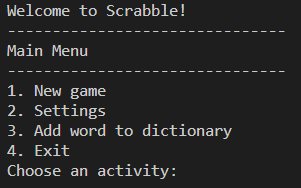
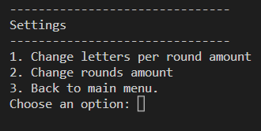
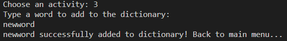
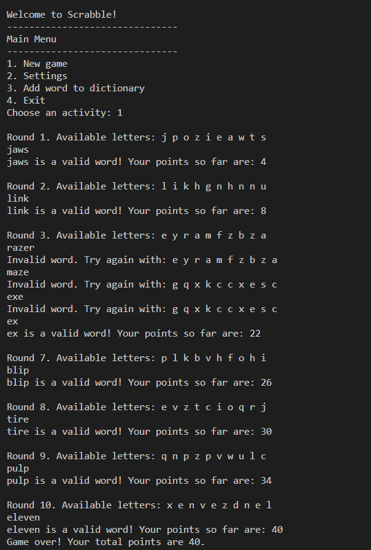

# **Scrabble**

## Project information

*This is a project for the course "Introduction to programming" at Faculty of Mathematics and Informatics - Sofia University, Software Engineering, Winter Semester 2022/23. The project is meant to be a playable Scrabble game inside the console, using a dictionary text file which can be updated in-game. You can look at some footage down below. Written in C++.*

---

## **Main menu**
When starting the program, the first thing that pops up is the main menu.

---

## **Settings menu**

The settings menu provides you with the options to either change the amount of rounds per game or change the amount of letters generated per round.

---

## **Add word to dictionary**
You can also add words in the dictionary by choosing option 3 from the main menu.

---

## **Game**

---

# Contact Me

&nbsp;&nbsp;&nbsp;&nbsp;&nbsp;&nbsp;&nbsp;&nbsp;&nbsp;
&nbsp;&nbsp;&nbsp;&nbsp;&nbsp;&nbsp;&nbsp;&nbsp;&nbsp;
&nbsp;&nbsp;&nbsp;&nbsp;&nbsp;&nbsp;&nbsp;&nbsp;&nbsp;
&nbsp;&nbsp;&nbsp;&nbsp;&nbsp;&nbsp;&nbsp;&nbsp;